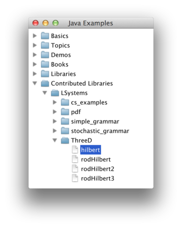

Exercises — Rewriting Grammars
==============================

### [Exercise 01][] — Lindenmeyer System

1. Install the [LSystem Library][Link11] by Martin Prout
   * install it in your `Processing/libraries` folder (See [here][Link12])
   * restart Processing
2. Run the [3D Hilbert Curve Example][Exercise 01] included in the exercise folder.  
   You should also be able to find this example inside the library examples:
   
   
   
3. Pick one of the two tasks below:
   * Modify the interpretation to create your own visual  
   * Modify the ruleset to create your own structure

### [Exercise 02][] — Context Free Art

1. Download the [Context Free Art][Link21] software and study the [CFDG language specs][Link22]
2. Go to the Park for inspiration
3. Create a `.cfdg` File, that draws a treelike image

### [Exercise 03][] — StructureSynth

1. Download the [StructurSynth Software][Link31] and study the [EisenScript language specs][Link32]
2. Go to the Park for inspiration
3. Translate your `.cfdg` file to an analogue 3D `.es` file, to draw a 3D tree

### [Exercise 04][] — ContextFree P5 (optional)

1. Study the [Mountain 3D demo][Link41]
2. Reuse the code to display your own `.cfdg` tree
3. Add interaction + animation

[Exercise 01]:coding_gestalt__exercise_04_01__lsystem
[Exercise 02]:coding_gestalt__exercise_04_02__contextfreeart
[Exercise 03]:coding_gestalt__exercise_04_03__structuresynth
[Exercise 04]:coding_gestalt__exercise_04_04__contextfree_p5

[Link11]:https://kenai.com/projects/l-system-utilities/downloads
[Link12]:http://wiki.processing.org/w/How_to_Install_a_Contributed_Library

[Link21]:http://www.contextfreeart.org/
[Link22]:http://glyphic.s3.amazonaws.com/cfa/download/CF%20nutshell%20A4.pdf

[Link31]:http://structuresynth.sourceforge.net/
[Link32]:http://structuresynth.sourceforge.net/reference.php

[Link41]:../demo/mountain_3d/